# Build Time Logger Visual Studio Extension

**Supported Visual Studio Versions**: 2017, 2019

## Extension Structure

The extension entry point is `BuildMonitorPackage.cs`, which registers the package with Visual Studio using the attribue values declared before the class definition.

As of VS2019, packages are required to be loaded Asynchronously. Extensions by default are set to load when their corresponding UI element is made visible, but as this extension needs to primarily run as a background service to detect build events, it has also been configured to auto-load on start-up in the background (this does mean that devs will need to wait until VS notifies that all background extensions have been loaded before building).

Instructions on how to asynchronously load an extension in the background can be found [here](https://docs.microsoft.com/en-us/visualstudio/extensibility/how-to-use-asyncpackage-to-load-vspackages-in-the-background?view=vs-2019).

The extension consists of the following:

- A `BuildTimeLoggerSettings.cs` file in `BuildTimeLogger/Settings`. This file inherits from a `BaseOptionModel` class which implements helpers for saving/retriving settings from the VisualStudio SettingsStorage service. It uses C# attributes to declare metadata about the settings so that Visual Studio can render it in it's options page. More information about Visual Studio Options Pages can be found [here](https://docs.microsoft.com/en-us/visualstudio/extensibility/creating-an-options-page?view=vs-2019).

- A `BuildLogModel.cs` file in `BuildTimeLogger/Models`. It declares the build data fields that will be populated and sent to the logging service.

- An `InfluxDBLogger.cs` file in `BuildTimeLogger/Loggers` which is a specific implementation of the `IBuildLogger` interface. It's purpose is to read the configured settings from the settings class, and when provided a `BuildLogModel` object, serialise it to the InfluxDB LineProtocol format and then send a http request to the InfluxDB server configured.

- A `BuildEventMonitor.cs` class which inherits from the Visual Studio interface `IVsUpdateSolutionEvents2` which declares the functions required to be implemented in order to be notified of build update events. It expects to be given an `IBuildLogger` instance, a Visual Studio `IVsOutputWindowPane` object to log build information, and a Visual Studio `DTE` service instance to access additional Visual Studio environment information (namely the solution name). It is given to the Visual Studio `IVsSolutionBuildManager2` service, which will use the interface functions to notify it of build events. This is the class that 'glues everything together' and records machine information, build times, etc in a `BuildLogModel` object and logs the data at the appropriate times using the configured `IBuildLogger` service.

- `TestConnectionToolWindowControl.xaml` and `TestConnectionToolWindowControl.xaml.cs` for describing and controlling a `Tool Window` that can be used to test the database connection. It accesses the currently configured BuildLogger via the `LoggerProvider` singleton instance.

## Tests

Some simple unit tests have been setup in the `BuildTimerLoggerTests` project in the `BuildTimeLoggerTests.cs` file.

The focus of the tests are in ensuring the data extracted from the build events and the general machine environment are formatted correctly to the expected InfluxDB Line Protocol format.

## Creating Docker Build Image

A `Dockerfile` has been included in this project with the setup required to create an image that can build this extension. 

>NOTE: This requires docker on windows to be set to `Windows Containers` mode. You can do this by right clicking on the docker destkop tray icon and selecting `Switch to Windows containers...`. For more information see here: https://docs.docker.com/desktop/windows/#switch-between-windows-and-linux-containers

Building the image can be done simply by running the `build-builder.ps1` script. In case of a restricted Execution Policy, the following can be used to allow script execution soley in the current shell process.

```powershell
# Disable execution policy for this shell process only just to run the build-builder script
Set-ExecutionPolicy Bypass -Scope Process; .\build-builder.ps1
```

## Building in the Docker Container

Once the docker container has been built, you can run a shell inside the container, mounting the contents of this repo, as so:

```powershell
docker run --rm -it -v ${PWD}:c:\data vs-logger-builder:vs2019
```

Once in the shell, you can then cd into the mounted `data` directory and then run the build script:

```powershell
cd c:\data
.\build-extension.ps1
```

This should then build the extension to `BuildTimeLogger/bin/Release/BuildTimeLogger.vsix`.

Once finished you can exit the container by typing in `exit`.

# Deploy VS Build Timer Plugin With PowerShell Script

This repo contains the deployment files needed to automate the installation of the Visual Studio Build Time Plugin.

The main script is `deploy-extension.ps1` and it accepts the following parameters:

| Parameter     | Possible Values       | Description                                                                                                  |
| ------------- | --------------------- | :----------------------------------------------------------------------------------------------------------- |
| Target        | any, latest           | Defines whether to install only for the latest Visual studio installation, or all compatible installations   |
| ExtensionUrl  | Any valid url string  | (Optional) Specifies the url to download an extension to install on the targeted visual studio installations |
| ExtensionPath | Any valid path string | (Optional) Specifies a path to a local extension to install on the targeted visual studio installations      |
| SettingsPath  | Any valid path string | (Optional) Specifies the path to a local settings file to apply to the targeted visual studio installations  |

It uses the [VSSetup](https://github.com/microsoft/vssetup.powershell) PowerShell module in order to detect installed visual studio instances. If the module is not installed, it will attempt to install it - so ensure you run the script on a machine with an internet connection. It may also need be run the first time in an Administrator PowerShell instance to make sure it is installed (or you can pre-install it before running this script).

Some example usages of the script:

```powershell
# Download the extension from a MarketPlace Url, install it in all compatible visual studio installations, and apply a supplied settings file.
.\deploy-extension.ps1 -Target all -ExtensionUrl <marketplace-url> -SettingsPath <path to .vssettings file>

#Install an already downloaded extension, and apply a supplied settings file
.\deploy-extension.ps1 -Target latest -ExtensionPath <extension-path> -SettingsPath <path to .vssettings file>

# Only apply settings to the latest Visual Studio Instance
.\deploy-extension.ps1 -Target latest -SettingsPath

# Only install an extenssion to all Visual Studio instance
.\deploy-extension.ps1 -Target latest -ExtensionPath <extension-path>
```

A premade invokation of this script can be found in `install-extension.ps1` which attempts to install the plugin for all Visual Studio installations using the provided `.vssettings` file.


## Manually Installing the Extension

Double click on the provided `BuildTimeLogger.vsix` file. This should launch an installer which will allow you to select which version of Visual Studio to install the extension for.

### Manual Settings Import

To import pre-configured database settings using Visual Studio first go to the tools menu and find the `Import and Export Settings` options:

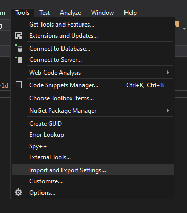

\
\
In the Wizard window that pops up select `Import selected environment settings`:

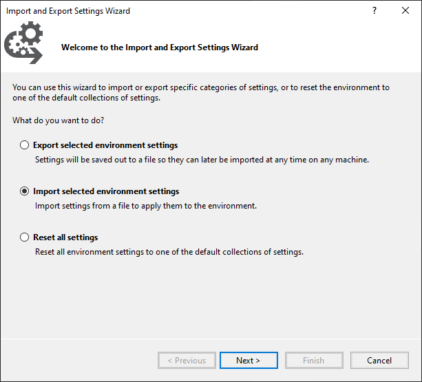

\
\
In the next section, you can choose to back up your existing settings just in case, but since we are just adding new settings for a specific section, you can by pass this:


\
\
In the next window, click the `Browse` box in the bottom:

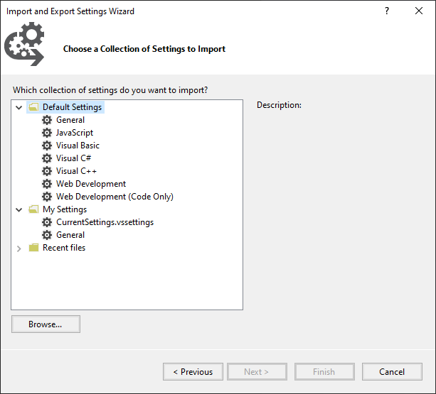

\
\
In the window that pops up, navigate to the previously exported settings you wish to use:

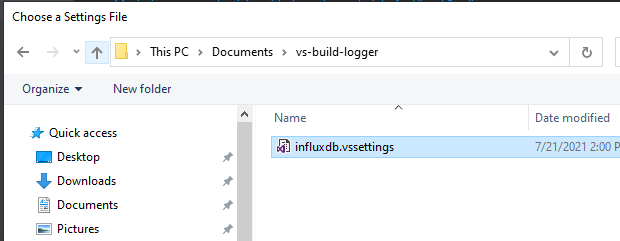

\
\
Once the settings are selected, you can then click next:

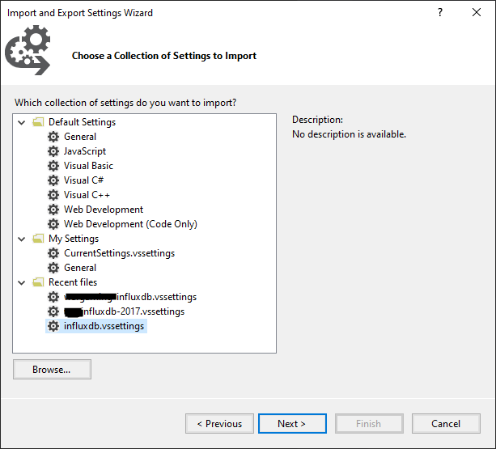

\
\
The final page should confirm that the settings import is for the extension:

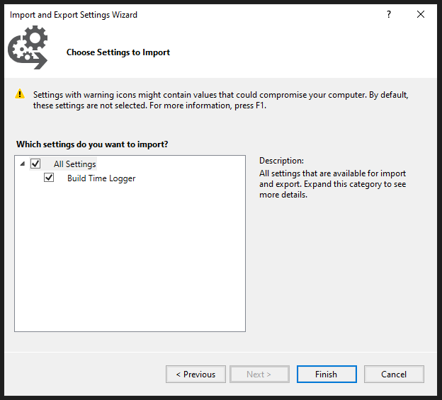

\
\
After importing, you can confirm that it worked by navigating to the `Options` window:

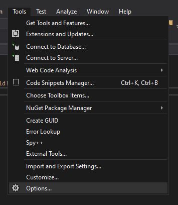

\
\
You should see the following settings configured in the options pane:


### Manual Settings Export

With the BuildTimeLogger extension installed, click on the `Tools` menu, and in the dropdown select `Import and Export Settings...`:


\
\
From the dialog setting that pops up, you can choose to export/import settings:

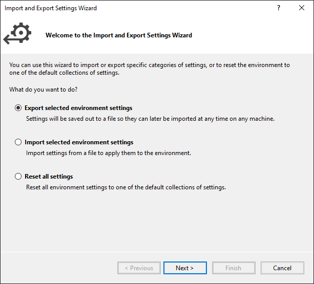

\
\
For exporting, in the next dialog window, select specifically the BuildTimeLogger if you only want to export settings for the BuildTimeLogger extension:

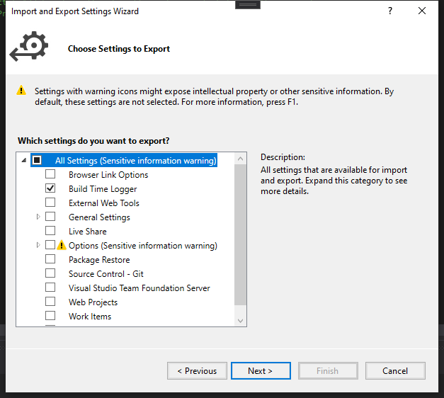

For importing settings, you can either export settings configured in a different Visual Studio instance, or you can manually populate the provided `sample-settings.vssettings` file and manually import it using the import dialog option.

For automated deployment using a script see [this section](#management-using-powershell-script).


## Using the Extension

With the extension installed, after opening a Visual Studio solution/project the extension will load asynchronously in the background - you will see this pop up indicating that this is happening:

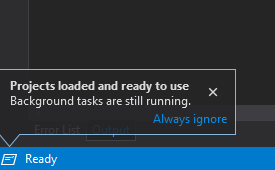

\
When the extension is ready, you will see this appear in a dedicated output window:

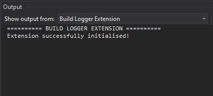

> NOTE: Depending on your layout, you may have to go to `View -> Output` in order to show the output window pane.

To configure InfluxDB settings, you can access the options men from `Tools -> Options`:


\
From here, you can configure which version of InfluxDB to set configuration for. Based on the version selected in the `InfluxDB Version` setting drop down the extension will use information configured in the corresponding sub-section.

Additionally, the `Log User` option can be set to include the Windows username of the current logged in account with the build information (by default this tag will be populated with 'N/A').

If you're in an environment where attempting to log to a server is not possible, you can disable logging with the `Logging Enabled` setting.


### Testing Database Connection

In order to make sure your database settings have been configured correctly, you can use a helper window, found in `View ->  Other Windows -> Build Time Logger -> Test InfluxDB Connection`:


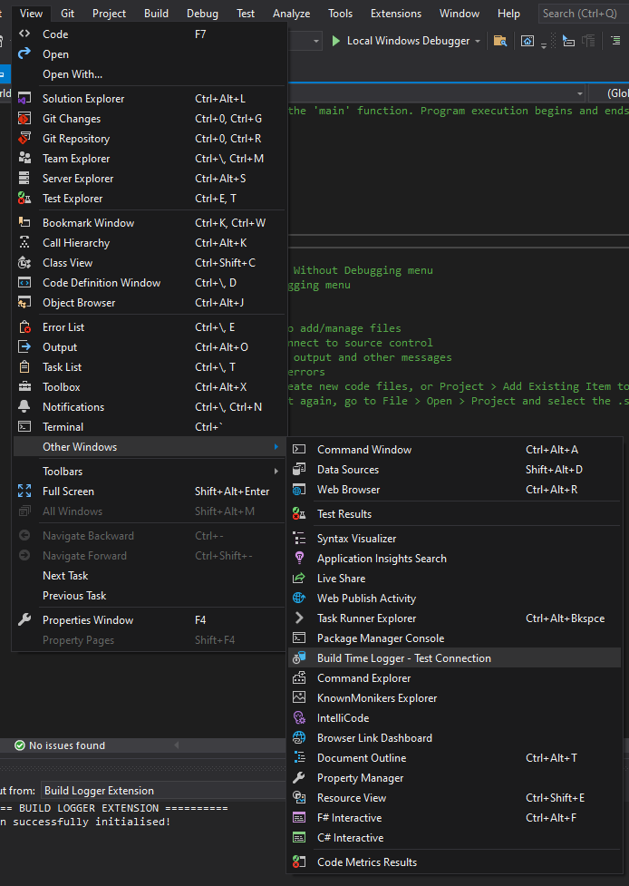

\
This will show the following window which you can use to test the database connection


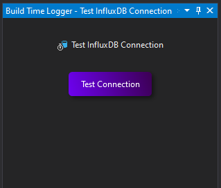


> NOTE: this will only test availability of the database - it will not test credentials. If there are issues with your InfluxDB credentials, it will be recorded in the `Build Logger Extension` output pane when you attempt to build a project.

Once you have set up the extension configuration and determined you have connectivity to the database, and you can go ahead and build your project.

While build logging is enabled, build information will then attempt to be logged to InfluxDB everytime you run a build/rebuild event.